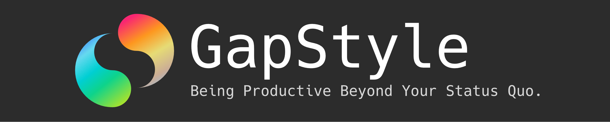
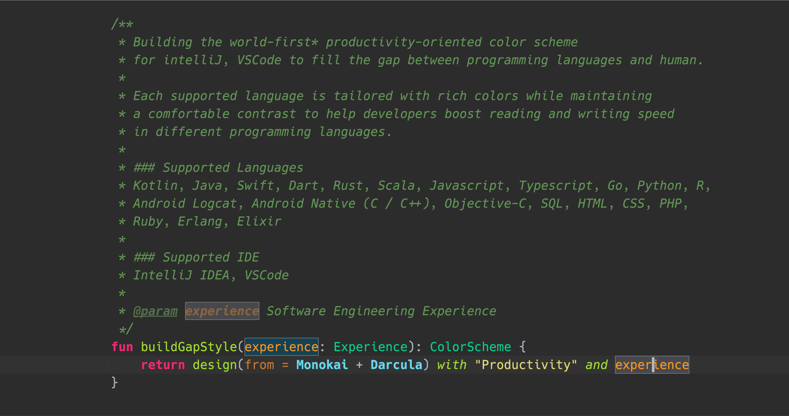

  
  

# GapStyle - Being Productive Beyond Your Status Quo.

GapStyle is a **_world-first_\*** **_productivity-oriented_** and **_semantic-highlighting-driven_** designed color
scheme that **_[each supported language](#actively-maintain-language)_** is tailored with
**_[rich colors while maintaining a comfortable contrast](#gapstyle-specification)_** to help developers boost reading
and writing speed in different programming languages.

GapStyle helps you to:

- Boost reading and writing speed by easily distinguishing syntax from colors and font styles. (Especially the language
  you are not familiar with)
- Quickly learn similar syntax across different languages with a universal designed color
- Spot errors before program execution

<small><i>\* world-first color scheme uses affinitive color plate design\*\* to boost developers' productivity.

\*\* affinitive color plate design uses similar colors to represent sematic-similar syntax, i.e., "class and abstract class", "function parameters, local variables, instance variables". See GapStyle SpecificationSee [GapStyle Specification](https://github.com/gaplo917/GapStyle/tree/master/spec#color-palette)
</i></small>

## Screenshots

### IDE

|                                                                                             |                                                                                         |
| :-----------------------------------------------------------------------------------------: | :-------------------------------------------------------------------------------------: |
|  Intellij |  VSCode |

### Language Preview

|                                                                                                                 |                                                                                                               |
| :-------------------------------------------------------------------------------------------------------------: | :-----------------------------------------------------------------------------------------------------------: |
|  Kotlin (Android Studio / Intellij) |   Java (Android Studio / Intellij)  |
|           Swift (App Code)           |          Scala (Intellij)          |
|      Javascript (Intellij)      |    Python (PyCharm / Intellij)    |
|          Go (GoLand / Intellij)         |  PHP (PhpStorm/ WebStorm/ Intellij)) |
|        Android Logcat       |                                                                                                               |

## Actively Maintain Language

| IDE                                                                   | Supported Language                                                                                                                                                              |
| --------------------------------------------------------------------- | ------------------------------------------------------------------------------------------------------------------------------------------------------------------------------- |
| [IntelliJ](https://github.com/gaplo917/GapStyle/tree/master/intellij) | Kotlin, Java, Swift, Dart, Rust, Scala, Javascript, Typescript, Go, Python, R, Android Logcat, Android Native (C / C++), Objective-C, SQL, HTML, CSS, PHP, Ruby, Erlang, Elixir |
| [VSCode](https://github.com/gaplo917/GapStyle/tree/master/vscode)     | Kotlin, Java, Swift, Scala, Javascript, Typescript, C++, Go, Python, PHP, HTML, XML, JSX, CSS/SCSS/SASS                                                                         |
| [XCode](https://github.com/gaplo917/GapStyle/tree/master/xcode)       | Swift, Objective C                                                                                                                                                              |

# Learn More About GapStyle

### How can GapStyle boost productivity?

- [GapStyle Specification](spec/README.md#gapstyle-specification)
  - [Semantic Highlighting Optimized](spec/README.md#semantic-highlighting-optimized)
  - [Recommended Font](spec/README.md#recommended-font)
  - [Color Palette](spec/README.md#color-palette)
  - [Special Styling](spec/README.md#special-styling)
  - [Special File Type](spec/README.md#special-file-type)

# Sponsor

