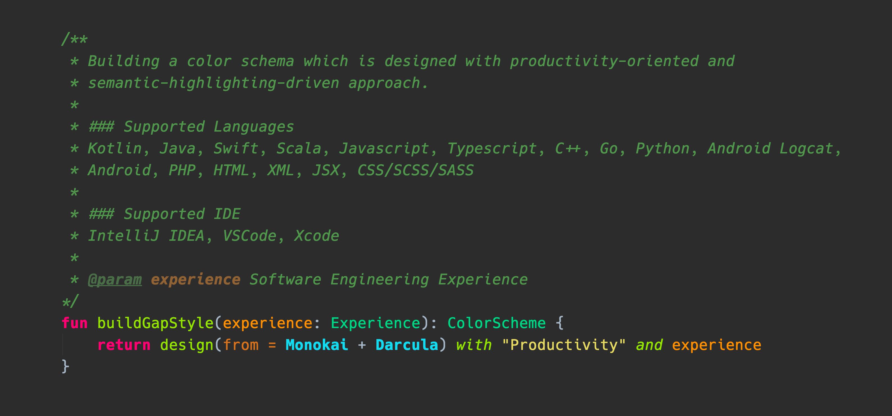

# GapStyle Theme For IntelliJ, VSCode and XCode

  

GapStyle is a **_productivity-oriented_** and **_semantic-highlighting-driven_** designed
color scheme with a [list of supported languages](#actively-maintain-language). Each
supported language is tailor made and carefully tuned with
[rationale](#gapstyle-specification).

You should feel comfortable if you use 'Monokai' or 'Darcular' theme previously.

## Objectives

- Optimize languages' color schemes to boost productivity on reading/writing code
  (Especially the language your are not familiar)
- Quickly learn similar syntax with a universal designed color across different languages
- Spot syntax error before IDE inspection

## Screenshots

### IDE

|                                                                                             |                                                                                         |
| :-----------------------------------------------------------------------------------------: | :-------------------------------------------------------------------------------------: |
|  Intellij |  VSCode |

### Language Preview

|                                                                                                                 |                                                                                                               |
| :-------------------------------------------------------------------------------------------------------------: | :-----------------------------------------------------------------------------------------------------------: |
|  Kotlin (Android Studio / Intellij) |   Java (Android Studio / Intellij)  |
|           Swift (App Code)           |          Scala (Intellij)          |
|      Javascript (Intellij)      |    Python (PyCharm / Intellij)    |
|          Go (GoLand / Intellij)         |  PHP (PhpStorm/ WebStorm/ Intellij)) |
|        Android Logcat       |                                                                                                               |

## Actively Maintain Language

| IDE                                                                   | Supported Language                                                                                                               |
| --------------------------------------------------------------------- | -------------------------------------------------------------------------------------------------------------------------------- |
| [IntelliJ](https://github.com/gaplo917/GapStyle/tree/master/intellij) | Kotlin, Java, Swift, Scala, Javascript, Typescript, C++, Go, Python, Android Logcat, Android, PHP, HTML, XML, JSX, CSS/SCSS/SASS |
| [VSCode](https://github.com/gaplo917/GapStyle/tree/master/vscode)     | Kotlin, Java, Swift, Scala, Javascript, Typescript, C++, Go, Python, PHP, HTML, XML, JSX, CSS/SCSS/SASS                          |
| [XCode](https://github.com/gaplo917/GapStyle/tree/master/xcode)       | Swift, Objective C                                                                                                               |

# Learn More About GapStyle

- [GapStyle Specification](spec/README.md#gapstyle-specification)
  - [Semantic Highlighting Optimized](spec/README.md#semantic-highlighting-optimized)
  - [Recommended Font](spec/README.md#recommended-font)
  - [Color Palette](spec/README.md#color-palette)
  - [Special Styling](spec/README.md#special-styling)
  - [Special File Type](spec/README.md#special-file-type)
