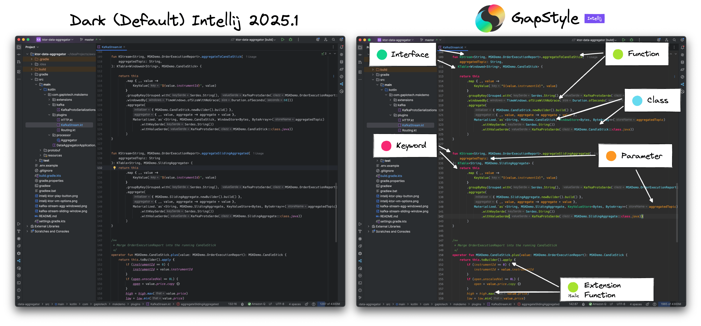
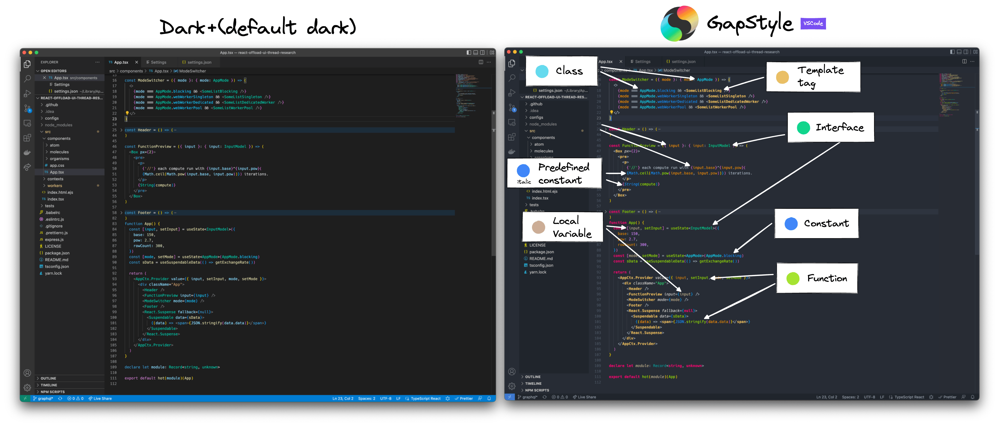
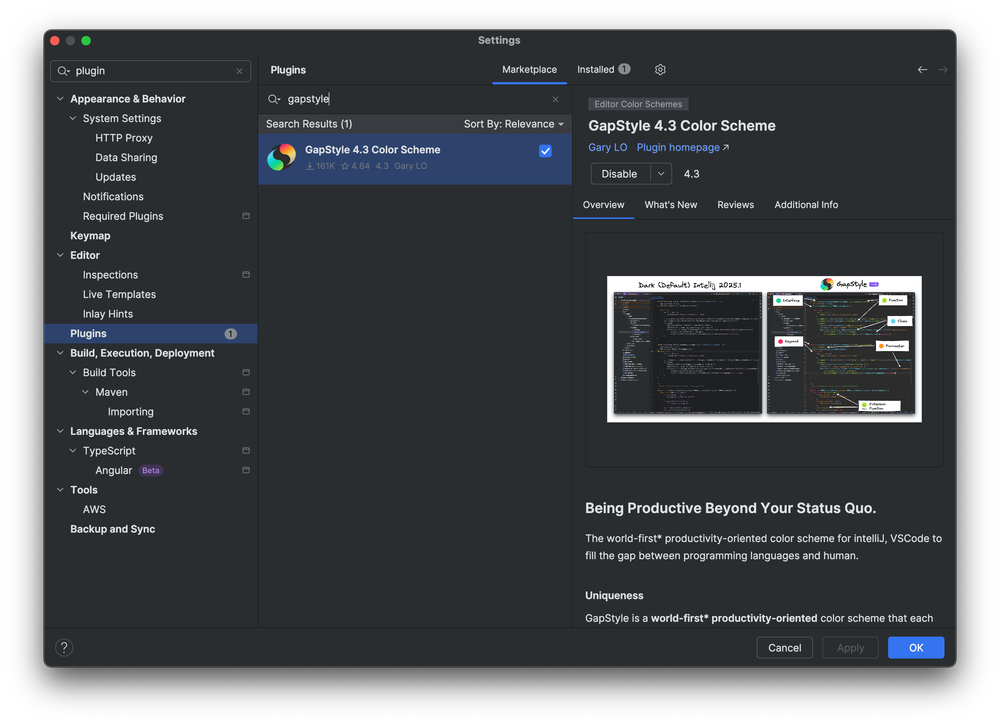

  
  

# GapStyle - Being Productive Beyond Your Status Quo.

GapStyle is the world's first productivity-oriented and semantic-highlighting-driven designed color
scheme.

**_[Each supported language](#actively-maintain-language)_** is tailored with
**_[affinitive colors while maintaining a comfortable contrast](#gapstyle-specification)_** to help developers boost reading
and writing speed in different programming languages.

GapStyle helps you to:

- Boost reading and writing speed by easily distinguishing syntax from colors and font styles. (Especially the language
  you are not familiar with)
- Quickly learn similar syntax across different languages with a universal designed color
- Spot errors before program execution

> [!NOTE]  
> The affinitive color plate design uses similar colors to represent sematic-similar syntax, for examples:
>  - `class`, `abstract class` and `interface`
>  - `function parameters`, `local variables` and `instance variables`
>
> See [GapStyle Specification](https://github.com/gaplo917/GapStyle/tree/master/spec#color-palette)

## Compare with default theme

#### Intellij

#### VSCode

## Actively Maintain Language

| IDE                                                                   | Supported Language                                                                                                                                                              |
| --------------------------------------------------------------------- | ------------------------------------------------------------------------------------------------------------------------------------------------------------------------------- |
| [IntelliJ](https://github.com/gaplo917/GapStyle/tree/master/intellij) | Kotlin, Java, Swift, Dart, Rust, Scala, Javascript, Typescript, Go, Python, R, Android Logcat, Android Native (C / C++), Objective-C, SQL, HTML, CSS, PHP, Ruby, Erlang, Elixir |
| [VSCode](https://github.com/gaplo917/GapStyle/tree/master/vscode)     | Kotlin, Java, Swift, Scala, Javascript, Typescript, C++, Go, Python, PHP, HTML, XML, JSX, CSS/SCSS/SASS                                                                         |
| [XCode](https://github.com/gaplo917/GapStyle/tree/master/xcode)       | Swift, Objective C                                                                                                                                                              |
| [Zed](https://github.com/gaplo917/GapStyle/tree/master/zed)           | All languages supported by Zed Editor                                                                                                                                           |

## Learn More About GapStyle

### How can GapStyle boost productivity?

- [GapStyle Specification](spec/README.md#gapstyle-specification)
  - [Semantic Highlighting Optimized](spec/README.md#semantic-highlighting-optimized)
  - [Recommended Font](spec/README.md#recommended-font)
  - [Color Palette](spec/README.md#color-palette)
  - [Special Styling](spec/README.md#special-styling)
  - [Special File Type](spec/README.md#special-file-type)

## Installation

### Intellij - Marketplace install

### Intellij - Manual install@

https://github.com/user-attachments/assets/e1b5e32e-3164-447e-9dd0-6af7538bc308

# Sponsor

# Contribution

- See [Intellij RELEASE.md](intellij/RELEASE.md).
- See [VSCode RELEASE.md](vscode/RELEASE.md).
