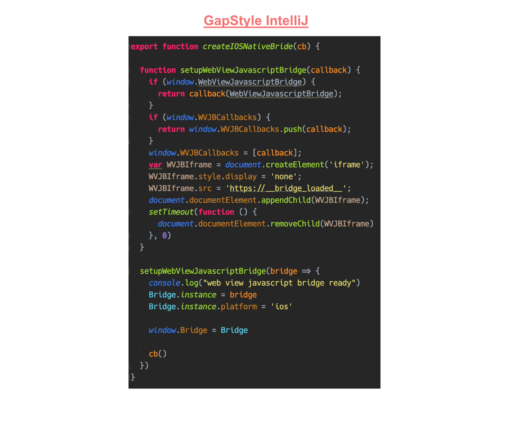

## GapStyle Specification

GapStyle is designed based on some key colors of the 'Darcula' and 'Monokai' colorschemes.

GapStyle is a **_productivity-oriented_** and **_semantic-highlight-optimized_** color
scheme with a [list of supported languages](#actively-maintain-language). Each supported
language is tailored and carefully tuned with [its rationale](#gapstyle-specification).

The first draft of GapStyle was created in 2014 in PhpStorm 8. After that, Gap has spent
10,000+ hours using the GapStyle colorscheme and at least 500+ hours of A/B testing,
tuning and stablizing throughout the years.

GapStyle is a unique and opinionated color scheme that has converged
[Gap's 5+ years of software development experience](https://github.com/gaplotech/bio)
(learning, reading and writing on various programming languages) into
productivity-oriented syntax highlighting based on GapStyle's specifications.

### Semantic Highlighting Optimized

#### Why we need highlighting?

When trying to understand what the code does,

1. we usually first try to recognize its coarse structure.
2. For that, we need a fast overview of the code.
3. With that overview, we can decide where we want to continue concentrating on.

Now the problem is, while building this overview, really many words have to be scanned.
Actually reading all of them would take a long time, and would be very annoying.

> Highlighting specific words in deterministic colors helps us to reduce that load

A productivity-oriented syntax highlighting scheme gives us familiar orientation points
and patterns that our eyes can “hook” onto, and allows us to find the specific position
more quickly.

Therefore, syntax highlighting helps us to keep an overview of or find the place we’re
searching for. However, it cannot help us actually understand the code. By the pure
definition of “syntax”, it can only highlight the tokens in the code, not by what the code
means, since that requires wider knowledge.

#### Semantic Highlighting

Semantic Highlighting to overcome that limitation, deeper knowledge of the code is
required. Semantic highlighting is an extension of syntax highlighting.

Different language has different richness of the semantic highlight implementation. Thus,
general designed theme without dedicate tuning for each language don't utilize semantic
highlighting well.

In contrast, GapStyle gives different semantics unique distinct colors and font styles.
Here is the result:

From my experience, GapStyle helps to improve my code-reading and writing speed by at
least:

- 30% when working on my own project

- 50% when studying other's source code and new languages

### Recommended Font

| Font                                                             | Platform | Ligature | Description                                                                                        |                             Action                              |
| ---------------------------------------------------------------- | -------- | :------: | -------------------------------------------------------------------------------------------------- | :-------------------------------------------------------------: |
| [Hack JBM Ligatured](https://github.com/gaplo917/Ligatured-Hack) | IntelliJ |    ✅    | Hack font with [JetBrains Mono](https://github.com/JetBrains/JetBrainsMono) ligature, built by Gap | [Download](https://github.com/gaplo917/Ligatured-Hack/releases) |
| [Hack FC Ligatured](https://github.com/gaplo917/Ligatured-Hack)  | IntelliJ |    ✅    | Hack font with [FIRA Code](https://github.com/tonsky/FiraCode) ligature, built by Gap              | [Download](https://github.com/gaplo917/Ligatured-Hack/releases) |
| [Hack](https://github.com/source-foundry/Hack)                   | IntelliJ |    -     | Standard Hack font                                                                                 |   [Download](https://github.com/source-foundry/Hack/releases)   |
| [Meslo LG DZ](https://github.com/andreberg/Meslo-Font)           | Xcode    |    -     | Solve Xcode no line-spacing settings                                                               |  [Download](https://github.com/andreberg/Meslo-Font/releases)   |

### Color Palette

| Syntax                  | Theme                           |                          Color                           | Philosophy                                                                                                                                                                                                                 |
| ----------------------- | ------------------------------- | :------------------------------------------------------: | -------------------------------------------------------------------------------------------------------------------------------------------------------------------------------------------------------------------------- |
| Default                 | Darcula                         |  | Monokai's default pure white color is too high contrast                                                                                                                                                                    |
| Keyword                 | Monokai                         |  |                                                                                                                                                                                                                            |
| String                  | Monokai                         |  |                                                                                                                                                                                                                            |
| Number                  | Monokai                         |  |                                                                                                                                                                                                                            |
| Class, Struct           | Monokai                         |  |                                                                                                                                                                                                                            |
| Abstract Class          | Derived from **Class**          |  | Always affinitive to **Class**. Should be distinguished from **Class** but not too eye-catching. To maintain overall harmony, just added slightly more green on    |
| Interface, Protocol     | Derived from **Abstract Class** |  | Should be distinguished easily from **Class/Abstract Class** but also should keep 'claim' with them. Add more green on                                             |
| Method                  | Monokai                         |  |                                                                                                                                                                                                                            |
| Parameter               | Darcula                         |  |                                                                                                                                                                                                                            |
| Local variable          | Derived from **Parameter**      |  | always affinitive to **Parameter**. Should be distinguished from **Parameter** but not too eye-catching. To remain overall harmony, just substract some orange on  |
| Annotation              | Darcula                         |  |                                                                                                                                                                                                                            |
| Comment                 | Darcula                         |  |                                                                                                                                                                                                                            |
| Doc                     | Darcula                         |  | should be distinguished from **Comment** and **String**                                                                                                                                                                    |
| Enum, Constant          | Custom                          |  | should be distinguished easily from **Parameter**, **Local variable**, **String**, **Number**                                                                                                                              |
| Typealias, Generic Type | Custom                          |  | should be distinguished easily from **Interface/Class/Abstract Class**                                                                                                                                                     |

### Special Styling

| Syntax                 | Style                                                                       | Philosophy                                                                                                   |
| ---------------------- | --------------------------------------------------------------------------- | ------------------------------------------------------------------------------------------------------------ |
| Keyword                | **Bold**                                                                    | Bold to stand out and emphasise its importance                                                               |
| Singleton              | **Bold**                                                                    | Preserves the same color but should also be distinguished easily from non-singleton objects                  |
| Global/Static variable | **_Italic + Bold_**                                                         | preserve same color but also should be distinguished easily from **Parameter** and **Local variable** tokens |
| Smart cast             |  (Background color) | Should be distinguishable easily                                                                             |
| Invalid Expression     |  (Undercurled line) | Inherited from Darcula                                                                                       |
| Reassigned Variable    | Underlined                                                                  | Inherited from Darcula                                                                                       |

### Special File Type

| File | Theme                       | Philosophy                                                                                                                                                                             |
| ---- | --------------------------- | -------------------------------------------------------------------------------------------------------------------------------------------------------------------------------------- |
| XML  | Darcula                     | NOT to use HTML-like highlighting because IntelliJ uses XML color scheme to highlight JSX's tags internally. Using Darcula's original color can overpower Monokai's **Keyword** color. |
| JSON | Derived from **JavaScript** | **Property Key** color should align with **JavaScript** Object                                                                                                                         |
