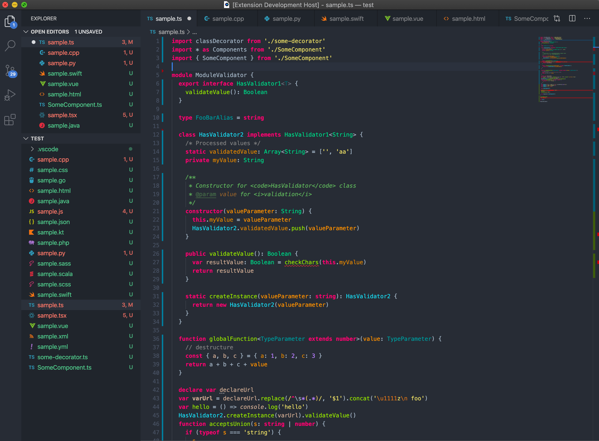

# GapStyle VS Theme



GapStyle is a **_productivity-oriented_** designed color scheme with a
[list of supported languages](#actively-maintain-language). Each supported language is
tailor made and carefully tuned with [rationale](#gapstyle-specification).

You should feel comfortable if you use 'Darcular' or 'Monokai' theme previously.

\* Enable `semanticHighlighting` for best experience

## Objectives

- Optimize languages' color schemes to boost productivity on reading/writing code
  (Especially the language your are not familiar)
- Quickly learn similar syntax with a universal designed color across different languages
- Spot syntax error before IDE inspection

## Actively Maintain Language

| IDE      | Supported Language                                                          |
| -------- | --------------------------------------------------------------------------- |
| IntelliJ | Kotlin, Java, Swift, Scala, Javascript, Go, Python, Android Logcat, Android |
| VSCode   | Kotlin, Java, Swift, Scala, Javascript, Go, Python, Android Logcat, Android |
| XCode    | Swift, Objective C                                                          |

## Enable Semantic Highlighting

1. Command + Shift + P
2. Search "settings.json" & Open
3. Paste the follow config on the

```
{
    "workbench.colorTheme": "GapStyle VS",
    "editor.tokenColorCustomizations": {
        "semanticHighlighting": true
    }
}
```

### Recommended Font

| Font                                                             | Platform | Ligature | Description                                                                                        |                             Action                              |
| ---------------------------------------------------------------- | -------- | :------: | -------------------------------------------------------------------------------------------------- | :-------------------------------------------------------------: |
| [Hack JBM Ligatured](https://github.com/gaplo917/Ligatured-Hack) | VSCode   |    ✅    | Hack font with [JetBrains Mono](https://github.com/JetBrains/JetBrainsMono) ligature, built by Gap | [Download](https://github.com/gaplo917/Ligatured-Hack/releases) |
| [Hack FC Ligatured](https://github.com/gaplo917/Ligatured-Hack)  | VSCode   |    ✅    | Hack font with [FIRA Code](https://github.com/tonsky/FiraCode) ligature, built by Gap              | [Download](https://github.com/gaplo917/Ligatured-Hack/releases) |
| [Hack](https://github.com/source-foundry/Hack)                   | VSCode   |    ❌    | Standard Hack font                                                                                 |   [Download](https://github.com/source-foundry/Hack/releases)   |

## Explore GapStyle On IntelliJ IDE

[IntelliJ](https://github.com/gaplo917/GapStyle)
